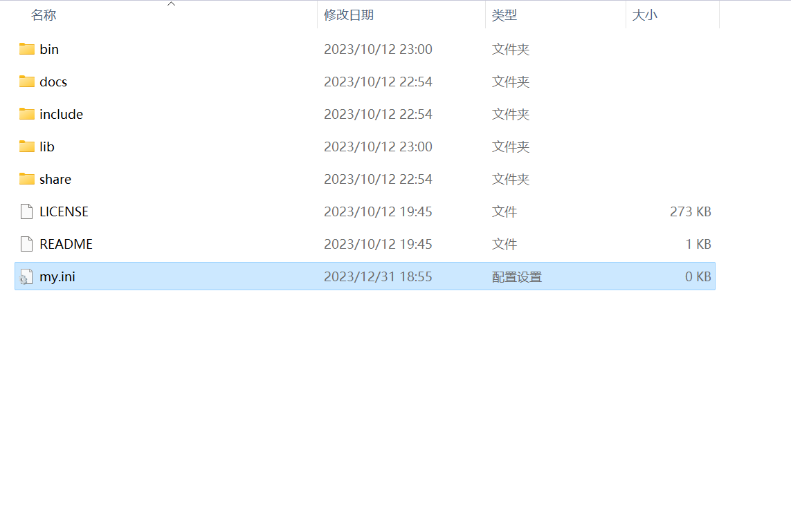
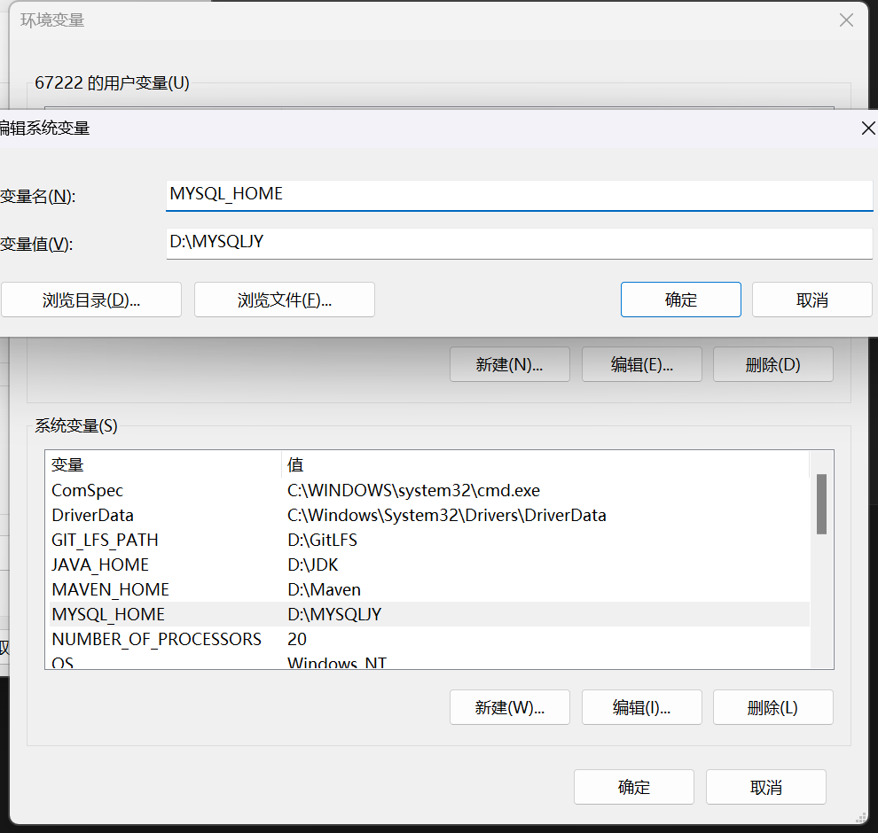

## Windows

### 解压配置方式
- [官网下载](https://cdn.mysql.com//Downloads/MySQL-8.0/mysql-8.0.35-winx64.zip)
- 解压到没有中文名称的目录
- 在解压目录创建my.ini文件并添加以下内容

```ini
[mysqld]
# 设置3306端口为MySQL服务端口
port = 3306
# 设置mysql的安装目录
basedir = D:\\path\\to\\mysql
# 设置mysql数据库的数据的存放目录
datadir = D:\\path\\to\\mysql\\data
# 允许最大连接数
max_connections = 20
# 服务端使用的字符集默认为UTF8
character-set-server=utf8
# 创建新表时将使用的默认存储引擎
default-storage-engine=INNODB

[mysql]
# 客户端默认使用的字符集
default-character-set=utf8

[client]
# 服务器端口
port = 3306
# 服务器的IP地址或者域名
host = 127.0.0.1
# 默认使用的字符集
default-character-set=utf8
```
- 配置环境变量




- 以管理员方式运行CMD，切换到安装目录下的bin目录中
```cmd
<!-- 初始化MYSQL，会生成临时密码 -->
mysqld --initialize --user=mysql --console

<!-- 安装mysql服务 -->
mysqld --install

<!-- 启动mysql服务 -->
net start mysql

<!-- 登录mysql -->
mysql -uroot -p

<!-- 修改mysql的root用户密码 -->
ALTER USER 'root'@'localhost' IDENTIFIED WITH mysql_native_password BY '123456';

<!-- 修改root用户的权限 -->
create user 'root'@'%' IDENTIFIED WITH mysql_native_password BY '123456';

<!-- 停止mysql服务 -->
net stop mysql
```

### 步骤安装

- [官网下载](https://cdn.mysql.com//Downloads/MySQL-8.2/mysql-8.2.0-winx64.msi)

- 双击运行

- 配置环境变量


## Linux

- 更新软件源

```shell
sudo apt-get update
```

- 安装MYSQL

```shell
sudo apt-get install mysql-server -y
```

- 启动MYSQL

```shell
service mysql start
```

- 停止MYSQL

```shell
service mysql stop
```

- 修改字符集编码

```shell
sudo chmod 777 /etc/mysql/mysql.conf.d/mysqld.cnf

sudo vi /etc/mysql/mysql.conf.d/mysqld.cnf

[mysqld]
character_set_server=utf8

sudo chmod 644 /etc/mysql/mysql.conf.d/mysqld.cnf

service mysql restart
```

- 查看编码问题
```shell
# 进入mysql
show variables like "char%";
```