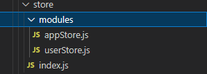

## React全局状态管理**Zustand**

```jsx
import create from 'zustand'

const useCounterStore = create((set) => ({
  // 数据
  count: 0,
  // 修改数据的方法
  increase: () => set(state => ({ count: state.count + 1 })),
  decrease: () => set(state => ({ count: state.count - 1 }))
}))


export default useCounterStore
```

## React全局状态绑定到组件

```jsx
import useCounterStore from './store'

const App = () => {
  const count = useCounterStore((state) => state.count)
  const decrease = useCounterStore((state) => state.increase)
  const increase = useCounterStore((state) => state.decrease)
  return (
    <div>
      <button onClick={decrease}>+</button>
      <span>{count}</span>
      <button onClick={increase}>-</button>
    </div>
  )
}

export default App
```

## 异步支持

```jsx
import { useEffect } from 'react'
import useListStore from './store'

const App = () => {
  const list = useListStore((state) => state.list)
  const fetchList = useListStore((state) => state.fetchList)
  useEffect(() => {
    fetchList()
  }, [])
  return (
    <div>
      {JSON.stringify(list)}
    </div>
  )
}

export default App
```

## React中使用Redux

在React中使用Redux，官方要求安装两个其他插件，Redux Toolkit（RTK），React-redux。

安装

```sh
pnpm i @reduxjs/toolkit react-redux
```

设计目录



编写

```jsx
import { createSlice } from "@reduxjs/toolkit";

const userStore = createSlice({
    name:'user',
    initialState:{
        username: '张三'
    },
    reducers:{
        changeUsername(state, action){
            state.username = action.payload
        }
    }
})

// 方法暴露
export const { changeUsername } = userStore.actions

// reducer暴露
export default userStore.reducer
```

注册

store/index.ts

```jsx
import { configureStore } from "@reduxjs/toolkit";
import userReducer from "./modules/userStore";

const store = configureStore({
    reducer:{
        userReducer
    }
})

export default store
```

main.ts

```jsx
<Provider store={store}>
  <App />
</Provider>
```

组件中的使用

```jsx
import './App.css'
import { useDispatch, useSelector } from 'react-redux'
import { changeUsername } from './store/modules/userStore'


function A() {
  const { username } = useSelector(state => state.userReducer)
  return <div>{username}</div>
}

function App() {
  const dispatcher = useDispatch()
  return (
    <>
      <A></A>
      <button onClick={ ()=> dispatcher(changeUsername('李四')) }>修改</button>
    </>
  )
}

export default App
```
